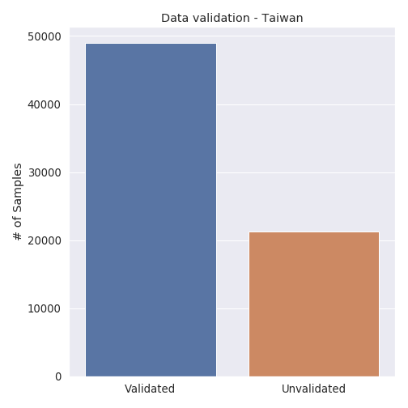
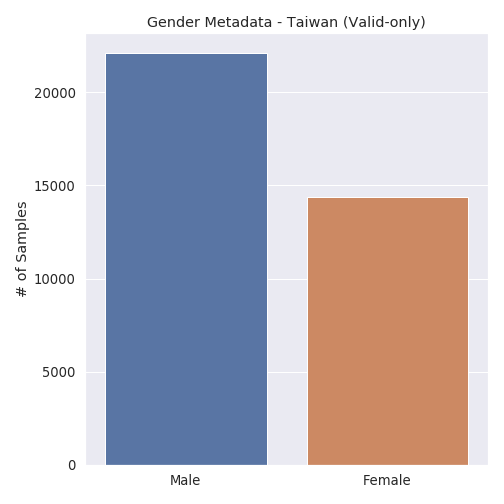
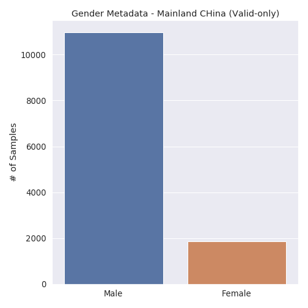
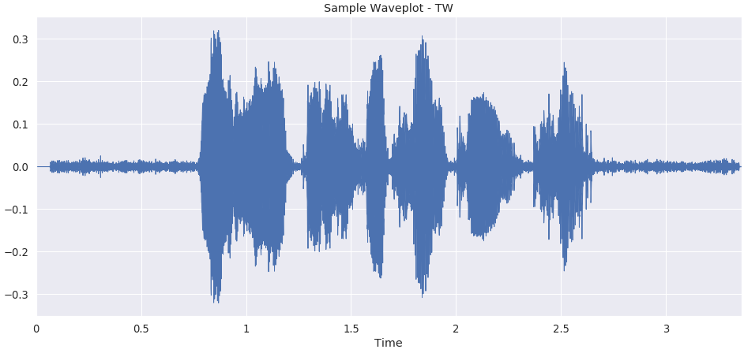
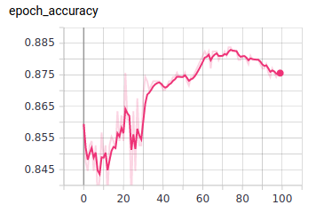
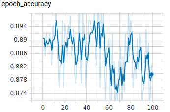
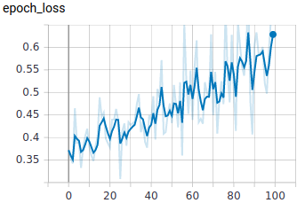
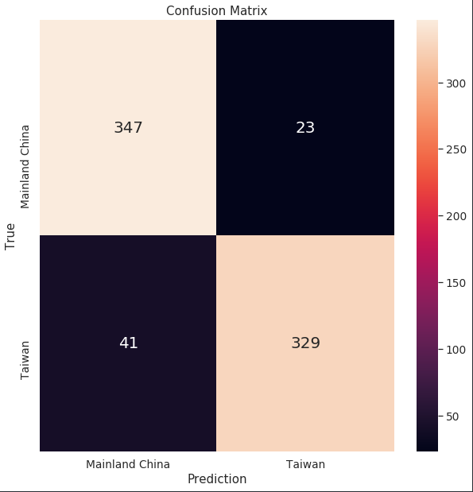
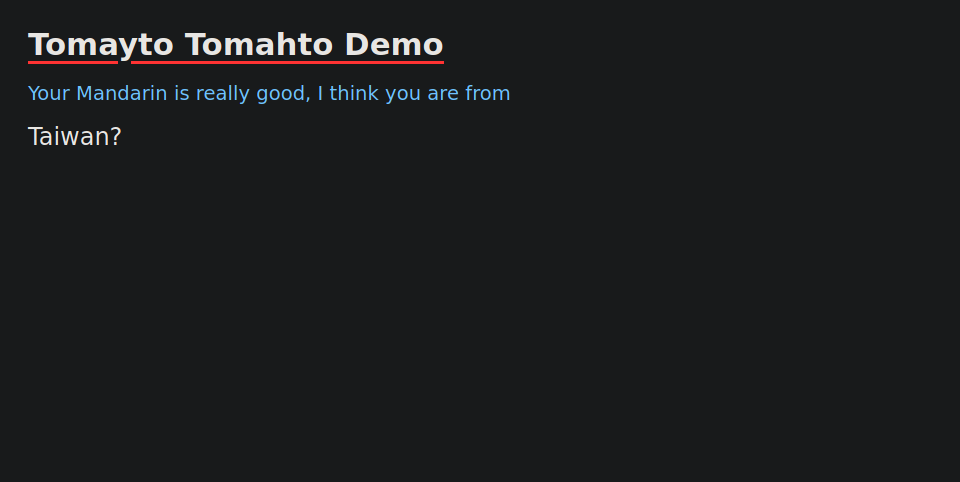

# Tomayto, Tomahto
Language Classification - Audio Processing with Convolution Neural Network
 
*By Tom Leung*

####  for a 3-minute summary presentation 

# Table of Contents
<!--ts-->
1. [Background and Motivation](#background-and-motivation)
2. [Data](#data) 
3. [EDA](#eda)
4. [CNN](#constructing-a-cnn)
    * [Pre-processing](#pre-processing)
    * [CNN Structure](#cnn-structure)
    * [Results](#results)
5. [Conclusion](#conclusion)
6. [Flask](#flask)
7. [Future work](#future-work)
8. [Credits](#credits)
<!--te-->

## **Background and Motivation**
A quick way to tell apart an American from a British person is to have them pronounce the word "tomato". Although they both speak English, their pronunciation is different (aka "accent"). The same applies to Mandarin Chinese as well. You can generally distinguish if someone is from Beijing or Shanghai by their accent. However, it only applies if you are very familiar with the language itself.
  
I was born and raised in Hong Kong, where we were taught three languages in school (Cantonese, English and Mandarin Chinese). However, Mandarin was not a language that I got to use very often in our day-to-day lives. After I moved to the US, my Mandarin has seemingly improved as I have made friends with many Mandarin-speakers from Mainland China and Taiwan, but it is still quite difficult for me to tell apart their accent sometimes.
  
Can a machine do it better? As a data scientist, I have two goals for this project:
1. Train a CNN to classify whether a given Mandarin speaker is from Mainland China or Taiwan
2. Build a working application to serve the model and make predictions in real time

## **Data**
Data obtained from the [Mozilla Common Voice](https://voice.mozilla.org/en) project, a crowd-sourced database aimed to open source speech recognition. Volunteers can visit the website and record themselves reading short sentences in their language. Other users can validate the integrity of the recording. I downloaded the Chinese (Taiwan) dataset and the Chinese (China) dataset. See the sample folder for two sample clips.

## **EDA**
(See details in nb/01_EDA; executable script in src/curate_data.py) 
The dataset was not very balanced, Taiwan has ~3 times more clips than China.
 

    

 
Monzilla included both validated and unvalidated clips in the pack. Generally, the unvalidated clips are quiet recordings or trolls playing music. The following is a breakdown of the clip validation:
 

    

 

Volunteers who recorded their voice could also submit their age, gender, accent. Unfortunately, some of the metadata were missing. I was mostly concerned with gender balance, because I wanted the model to have an equal opportunity to learn from both male and female voices. The Taiwanese set has a good mix of men and women. In contrast, there were many more audio clips recorded by Chinese men than women.

 

    
    

 

Due to the imbalance, I decided to curate a more balanced dataset. I randomly selected 1851 male and 1851 female audio clips from the validated pool of both Taiwan and China, then split them into train, test and hold-out sets with a 8:1:1 ratio. 

# **Constructing a CNN**
## **Pre-processing**
(See details in nb/02_Preprocessing; executable script in src/preprocessing.py) 
You may be wondering why convolutional neural networks are chosen for this task. Let's first look at how we can visualize sound.
  
Most people have probably seen a waveform before. It is plotting amplitude over time (you can think of amplitude as loudness)
 

    

 
What is missing from a waveform is the frequency (think of 'pitch'). This is where a spectrogram comes in. X axis is time, Y axis is frequency. Color denotes the amplitude.
 

    

 
Another form of presentation is the Mel-frequency cepstral coefficients (MFCC)
 

    

 
As you may suspect, audio recognition is actually an image recognition problem! Before I could train them in a CNN, I turned all the audio clips into mel-scaled spectrograms, padded/trimmed the audio clips that are either too short/long. The results were identically-shaped images.

### **Outline**
 

    

 

## **CNN Structure**
(See details in nb/03_Modeling; executable script in src/cnn.py) 
I experimented with many different structures, the following structure with 3 sets of Conv-Pool-Dropout gave the highest accuracy

| Layers | Output Shape | # Parameter |
|--------|--------------|-------------|
| Conv2D | 128, 256, 32 | 832 |
| MaxPooling2D | 42, 85, 32 | 0 |
| Dropout | 42, 85, 32 | 0 |
| Conv2D | 42, 85, 64 | 51264 |
| MaxPooling2D | 14, 28, 64 | 0 |
| Dropout | 14, 28, 64 | 0 |
| Conv2D | 14, 28, 128 | 204928 |
| MaxPooling2D | 4, 9, 128 | 0 |
| Dropout | 4, 9, 128 | 0 |
| Flatten | 4608 | 0 |
| Dense | 256 | 1179904 |
| Dense | 2 | 514 |

Input shape: 5924 x 128 x 256
  
Training was done on an EC2 GPU instance over 100 epochs

## **Results**

### Base CNN model
I started with a simple set-up with 2 Conv-Pool layers, validation accuracy converges to 86% after 70 epochs. Accuracy against the hold-out set was 89.19%.
 

    
    

### Final CNN Model
In order to prevent overfit, drop-out layers were added to the structure, and it helped reach 91% validation accuracy against the hold-out set. Here I have learned that blindly adding epochs do not always improve the model. It converged to the highest validation accuracy early-on in the training process.
 

    
    

 

| Model | Hold-out Accuracy |
|--------|--------------|
| Base | 89.19% |
| Final | 91.35% |

    

The best model had fairly great precision and recall rate
| Metric | Rate |
|--------|--------------|
| Recall | 88.9% |
| Precision | 93.4% |

## **Flask**
I built a flask app serving the tensorflow model on an EC2 instance. You can check it out [HERE](https://13.52.56.68/). The code base is maintained in [this repo](https://github.com/tchleung/tomayto_tomahto_flask/).
  
You can record a sentence (~3 minutes) using the voice recorder and save it as a .wav file. Upload the recording to the server, and it will show you the prediction. Screenshots are taken running on Firefox on Ubuntu.
 

    
    

 
Screenshots of it running in Firefox Mobile on a Pixel 3a

   
   

## **Conclusion**
I tested the app with multiple Mandarin speakers. The result is generally accurate but it depends on the sentence that is spoken. I would imagine that there are certain words that highlight the phonetic difference, and the model may not have trained on them. A more controlled environment would be needed for that.
 
 
So what does this teach us? The same process can be replicated and expanded to multiple languages, accents, even genders and ages. There are many use cases for such techniques. For example, we could use it to generate metadata of a user. A voice-activated smart device can return more personalized content based on someone's accent; imagine if your father from Boston is using your Alexa to check the NFL score, and it talks about the Patriots first. Also, it could be used to tag a video or audio. Say Youtube could automatically tag the language or geography of any given upload. It could also be used to improve speech synthesis, perhaps in the future Google Assistant can speak with a thick Southern accent, how cool would that be?
 
 
Due to the self-policing nature of the common voice project, there is no assurance that all the metadata are correct. I was quite worried that many of the clips would be internet trolls, but I played a dozen samples and the voices did match the gender and the language, so it did give me some comfort that the data is somewhat clean. Overall, I am very satisfied with the outcome of the CNN model and the app.

## **Future Work**
Other use of the dataset: 
-- End-to-end speech-to-text 
-- Combine other languages for a multi-class classification
 
 
Improvement on the current model: 
-- Use transfer learning to see if it improves accuracy 
-- Automatically trim the clips based on voice activity 
-- Augment the audio files 
-- Use MFCC instead instead of mel-spectrogram
 
 
Flask improvement: 
-- Further customization of the front-end 
-- Add functionality for users to mark if the prediction is right or wrong, and save the recording, in order to accumulate even more data to improve the model

## **Credit**
Audio data from Mozilla Firefox (https://voice.mozilla.org/en)
 
Flask app recorder from Matt Diamond's Recorder JS (https://github.com/mattdiamond/Recorderjs)
 
Flask front-end design is modified from Addpipe's demo of Recorder JS (https://github.com/addpipe/simple-web-audio-recorder-demo)
